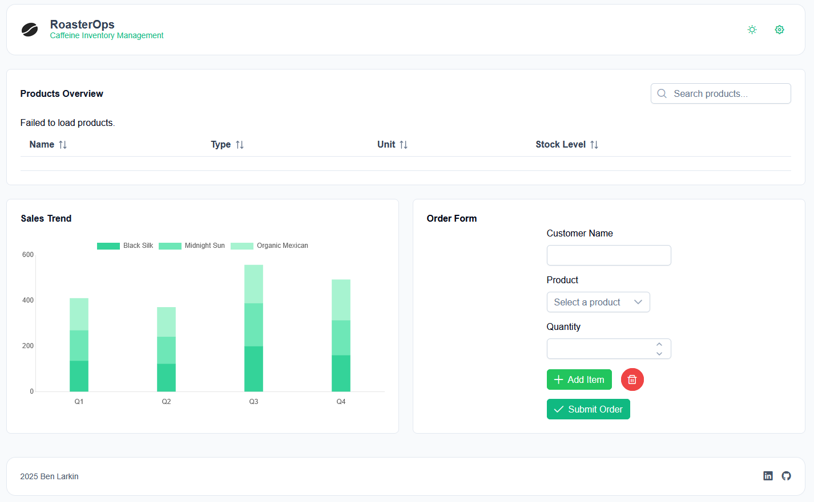

# RoasterOps ☕️

**RoasterOps** is a .NET-based internal tool designed to streamline and optimize coffee roasting operations. It provides an interface for managing batches, logging roasts, and coordinating production with ease.

---

## 🚀 Features

- Batch tracking and roast logs
- Inventory management
- Operator-friendly UI
- Built with C# and ASP.NET Core

---

## 🛠️ Tech Stack

- [.NET 8](https://dotnet.microsoft.com/)
- ASP.NET Core MVC
- Entity Framework Core
- SQL Server

## 🔧 WIP 
-  A modern Vue.js frontend is currently in development to complement the backend.
